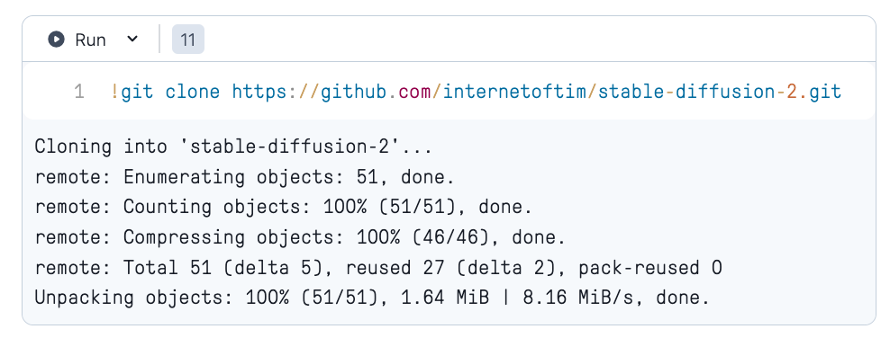

<!-- Copyright (c) 2022 Graphcore Ltd. All rights reserved. -->

# Simple Deployment walkthrough Notebook 

Step-by-step process to launch an API endpoint from within a notebook environment. The notebook also contains sample client and a way to expose the endpoint as a prototype endpoint for an external (beyond the notebook runtime) client.

As an example, this server is running a stable diffusion inference API under `/stable_diffusion_2_txt2img_512`


### Quickstart: Launch a Stable Diffusion API from Gradient

[](https://console.paperspace.com/github/graphcore/Gradient-HuggingFace?machine=Free-IPU-POD4&container=graphcore/pytorch-jupyter%3A3.2.1-ubuntu-20.04-20230531&file=stable-diffusion%2Ftext_to_image.ipynb)


Click Run on Gradient to load a notebook environment. The repo from this runtime doesn't contain our API code. You will need to clone this repo by running the following on a terminal:

```console
git clone https://github.com/internetoftim/stable-diffusion-2.git
```

or simply run it in a notebook cell:

<!--  -->


From there, open the notebook `stable-diffusion-2\notebook\local-test-and-deploy.ipynb`


# Config

The deployment workflow is relying on an example environment as outlined from the [API Deployment template](https://github.com/graphcore/api-deployment), check out the template to get a deep dive.


## Model configuration
Syntax of SERVER_MODELS environmental variable:
```
SERVER_MODELS='[
    ...
    {
        "model":"name of the directory where model is stored",
        "replicas":"number of replicas to run"
    },
    {
        "model":"name of the directory where model is stored"
    },
    ...
]'
```
Note that:
 - variable value has to be single quoted
 - `replicas` setting defaults to 1 replica if not set
 - `replicas` will have to meet available physical device (IPU) where you run this code. For example, if the stable-diffusion model is a 4-IPU pipeline, you can only set 1 replica to run this on a 4-device machine (POD4) and 4 replicas if you choose a 16-device machine (POD16)
 - although the example has new lines for clarity it is advised to keep value of `SERVER_MODELS` without whitespaces, most means of passing environmental variable with spaces will not work

## Adding a new model:

To serve a new model, the main steps are the following:

### 1. Add the model files to the repo
Add a Python folder `<new_model>/` in `src/models/` which will containn your model, the model pipeline, endpoint and any other required files. It instantiates a callable named `pipe` that takes the necessary input data (we can directly import Graphcore-Optimum `Pipeline` for instance).

In this example we consider `inputs` to be a Dict (you are free to change it).
You should also define a function `compile`: The input is your object `pipe` and the execution of this function should trigger the IPU compilation.

ex: `<new_model>/pipeline.py`

```python
class Pipeline:
    def __init__(self, args):
        # Various parameters initialisation

    def __call__(self, inputs: Dict) -> Dict:
        # pre-processing,
        # model call,
        # etc ..
        prediction_dict = ...
        return prediction_dict

def compile(pipe: Pipeline):
    # compilation logic goes here, for instance:
    # pipe(dummy_inputs)
    # ...
    return
...
pipe = Pipeline(args)
```
By implementing this interface, your new model will now be available as `<new_model>` (your file name) as a new IPUWorker.

### 2. Create the endpoint file
Create the endpoint for this new model. In `<new_model>/endpoint.py`:

```python
@router.post("/new_model", response_model=NMResponse, include_in_schema = "new_model" in models)
def run_nm(model_input: NM):
    data_dict = model_input.dict()
    w.workers["new_model"].feed(data_dict)
    result = w.workers["new_model"].get_result()
    return {
        "results": result["prediction"]
    }
```
In this simple example, our path operation is `/new_model`. We create the function `run_nm()` and use FastAPI decorator
`@router.post()` to make it receive POST requests, this connects to the central FastAPI application in `src/server.py`. Using `include_in_schema` boolean parameter will enable or disable this path given the list of model we configure.

Now, we can see we have 2 types describing our input and outputs: `NM` and `NMResponse`. These should be defined in the endpoint file `<new_model>/endpoint.py`. These use Pydantic `BaseModel` and will be used to automatically to match the `json` fields from the HTTP request and response. For instance:

```python
class NM(BaseModel):
    input_1: str
    input_2: str

class NMResponse(BaseModel):
    results: str
```
In this example, `NM` contains two fields, it can automatically be converted to `Dict` when calling `model_input.dict()`.

These are the 2 most important lines:
```python
w.workers["new_model"].feed(data_dict)
result = w.workers["new_model"].get_result()
```
The first one will select our "new_model" `IPUWorker` from the `IPUWorkerGroup` and feed the data dict to its input queue.
The second one will retrieve the results from the `IPUWorker` output queue.

Finally , return the results as a Dict to match `NMResponse` format.
Here we supposed our model prediction is available under the dict key `result["prediction"]`.

### 3. Edit your config.

By default the server is not configured yet to run your model.
To add it you can either: modify the default config in `src/config.py` and add it to `models` list.
Or temporary, modify the `.env` file variable `SERVER_MODELS` (or just set the environment variable `SERVER_MODELS`) to add your model name "new_model" to the list. (You should make sure you have enough IPUs available to run all the models in the list).

You can also modify the `.env` environment variable `SERVER_MODELS` at the deployment container runtime, if you wish to only run some of the deployed models.

### 4. Run the server
**Note: You can skip this step when you're using a fully-baked image that you made yourself or ones that are available in Graphcore's DockerHub.**

To run the server, build the docker image from the root repository folder:
```
    - docker build -t <deployment_name> .
```
Next, run the image. Ensure env variables `IPUOF_VIPU_API_HOST` and `IPUOF_VIPU_API_PARTITION_ID` are set on the host machine. Wait until the server boots up (all binaries have to be downloaded and graphs compiled):
```
docker run \
    -v $(pwd)/src:/src \
    -e POPTORCH_CACHE_DIR=/src/model_cache \
    -e HUGGINGFACE_HUB_CACHE=/src/model_cache/ \
    -e HF_HOME=/src/model_cache/ \
    --env-file <(env | grep IPU) \
    --network host \
    --device=/dev/infiniband/ \
    --cap-add=IPC_LOCK \
    <deployment-name>
```

Now if you run the server and go to the `IP_ADDRESS:PORT/docs` url, you should be able to see and test your new API !

(Optional) Next, stop the docker image. It has now been run and model executables and binaries have been generated. Run the build step again:
```
docker build -t <deployment_name> .
```
to bake the executables and binaries into the Docker image, so the models do not have to be recompiled when deploying.

Verify the image exists in the local image registry:
```
docker image list | grep custom-image-name
```

Then to upload the image to a custom container registry:
```
docker login
```
To store the image on DockerHub, the image path must start with your account name:
```
docker tag <deployment_name>:latest <dockerhub-username>/<dockerhub-deployment-name>:<optional-dockerhub-tag>
```
Then you can push the image to DockerHub:
```
docker push <dockerhub-username>/<dockerhub-deployment-name>:<optional-dockerhub-tag>
```


[](https://www.graphcore.ai/join-community)


<!-- https://console.paperspace.com/github/graphcore/Gradient-HuggingFace?machine=Free-IPU-POD4&container=graphcore/pytorch-jupyter%3A3.2.1-ubuntu-20.04-20230531&file=stable-diffusion%2Ftext_to_image.ipynb -->


Disclaimers:
-   This repository shows an example of how you might deploy a server. We encourage you to build on this example to create a service that meets the security and resiliancy requirements of your application.
